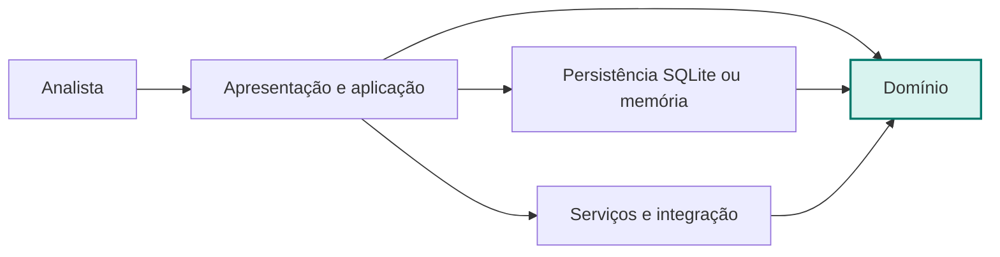
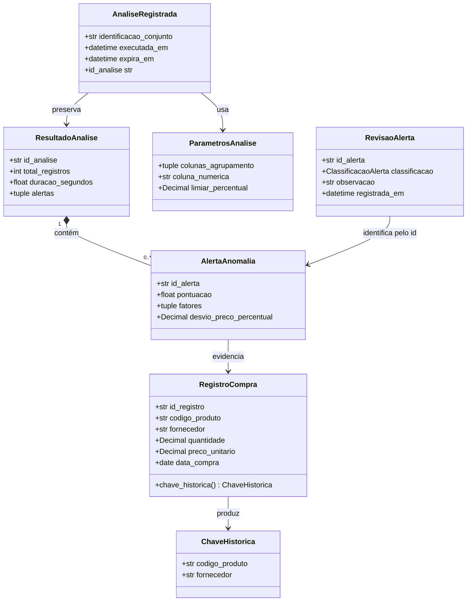

# Fase 3 Arquitetura do AnomaliData

Este documento consolida a arquitetura da primeira versão do AnomaliData. As
decisões preservam o Termo de Referência v1.3, o Roteiro de Entrevista v1.3 e as
estruturas medidas na Fase 2.

## 1. Visão geral da solução

O sistema será executado localmente por um único usuário. A aplicação importa
CSV ou XLSX, valida a entrada, executa a análise, apresenta os alertas e mantém
por 12 meses apenas metadados, parâmetros, alertas, classificações e o resumo da
execução em SQLite. O arquivo bruto não é copiado para o histórico.



Todas as dependências de código apontam para o domínio. O domínio não importa
módulos de tela, banco de dados ou integração. No código, a camada de entrada
será dividida entre adaptadores de apresentação e o pacote `aplicacao`, que
coordena os casos de uso sem armazenar regras de negócio em telas.

Fluxo principal:

1. a apresentação recebe o arquivo e os parâmetros;
2. a aplicação converte e valida cada linha por meio dos tipos do domínio;
3. o domínio agrupa os registros, calcula referências e produz alertas ordenados;
4. a apresentação exibe o resultado e permite a revisão humana;
5. a persistência grava o histórico permitido, sem reter o arquivo bruto.

## 2. Modelo de domínio



| Classe | Responsabilidade única |
|---|---|
| `RegistroCompra` | Representar uma linha válida da base importada. |
| `ChaveHistorica` | Identificar registros comparáveis por produto e fornecedor. |
| `AlertaAnomalia` | Reunir a evidência, a pontuação e os fatores de um desvio. |
| `ResultadoAnalise` | Consolidar uma execução e manter os alertas ordenados. |
| `ParametrosAnalise` | Tornar explícita e reproduzível a configuração usada. |
| `AnaliseRegistrada` | Definir os dados permitidos no histórico e sua expiração. |
| `RevisaoAlerta` | Registrar a classificação humana vigente para um alerta. |

As classes são imutáveis e validam suas invariantes na construção. Dados vazios,
valores não positivos, datas futuras, alertas fora de ordem e expiração diferente
de 12 meses são rejeitados por `DadoInvalidoError`.

## 3. Decisões de estruturas de dados

| Entidade | Operação predominante | Volume estimado | Estrutura e justificativa |
|---|---|---:|---|
| Registros da análise | Inserir e percorrer | 10.000 na validação; 20.000 no pico | `list[RegistroCompra]`, pois preserva a ordem e favorece o percurso sequencial. |
| Grupos históricos | Localizar e atualizar por chave | Até 2.000 grupos | `dict[ChaveHistorica, EstatisticaHistorica]`, com acesso médio constante. |
| Alertas | Inserir, ordenar e percorrer | Até 65 na execução aceita | Lista ordenada uma vez por pontuação, em ordem decrescente. |
| Revisões | Localizar e substituir por alerta | Uma revisão ativa por alerta | `dict[str, RevisaoAlerta]`, também usado pelo repositório em memória. |
| Histórico | Buscar por id, listar ativos e expurgar vencidos | 12 meses; quantidade não inventada | Índices SQLite por identificador, execução e expiração; volume será medido na construção. |

O benchmark da Fase 2 demonstrou 10.000 consultas no dicionário contra 9.095.848
comparações na busca linear para a mesma base de 10.000 registros.

## 4. Estratégia de persistência

**Alternativa escolhida:** banco SQLite local. A decisão atende à operação sem
conexão, ao uso individual, às consultas por histórico e à retenção definida no
Termo. Não existe sincronização remota nesta versão.

O esquema versionado está em
`src/anomalidata/persistencia/migrations/001_inicial.sql` e possui as tabelas:

| Tabela | Conteúdo persistido |
|---|---|
| `analysis` | Identificação do conjunto, parâmetro numérico, limiar, contagens, duração, resumo, execução e expiração. |
| `analysis_grouping_column` | Colunas de agrupamento e sua ordem. |
| `alert` | Somente os registros marcados, com referência, pontuação e desvio. |
| `alert_factor` | Motivos compreensíveis apresentados para cada alerta. |
| `alert_review` | Classificação vigente, observação, data e versão. |
| `schema_version` | Versões de esquema já aplicadas. |

Índices atendem às consultas por expiração, data de execução, alertas ordenados
por análise, histórico de produto/fornecedor e classificação. Valores `Decimal`
são armazenados como texto canônico para evitar perda de precisão na conversão
binária. Datas usam ISO 8601 em UTC e chaves estrangeiras são habilitadas.

Políticas:

- cada migração recebe número crescente e roda em transação;
- antes de migrar um arquivo existente, a aplicação criará uma cópia de segurança;
- falha reverte a transação e mantém a versão anterior utilizável;
- gravações de uma análise e seus alertas formam uma única transação;
- não há conflito distribuído, pois não há sincronização nem múltiplos usuários;
- a revisão mais recente substitui a anterior, incrementando `version`;
- análises vencidas são excluídas em cascata; o usuário pode excluí-las antes;
- o arquivo CSV ou XLSX bruto nunca é inserido no banco.

## 5. Contratos entre camadas

As interfaces são `Protocol` de Python e pertencem ao pacote `dominio`. A camada
de persistência apenas as implementa.

```python
class RepositorioAnalises(Protocol):
    def salvar(self, analise: AnaliseRegistrada) -> None: ...
    def buscar_por_id(self, id_analise: str) -> AnaliseRegistrada | None: ...
    def listar_ativas(self, referencia: datetime) -> tuple[AnaliseRegistrada, ...]: ...
    def excluir_por_id(self, id_analise: str) -> bool: ...
    def excluir_expiradas(self, referencia: datetime) -> int: ...

class RepositorioRevisoes(Protocol):
    def salvar(self, revisao: RevisaoAlerta) -> None: ...
    def buscar_por_alerta(self, id_alerta: str) -> RevisaoAlerta | None: ...
```

`RepositorioAnalisesMemoria` e `RepositorioRevisoesMemoria` comprovam a inversão
de dependência e permitem testar o domínio sem tela, arquivo, rede ou banco. O
adaptador SQLite da fase de construção obedecerá aos mesmos contratos.

## 6. Rastreabilidade

| Critério | Elementos de arquitetura que o sustentam | Verificação prevista |
|---|---|---|
| CA-01 | Adaptador CSV/XLSX, caso de uso de importação e `RegistroCompra` | Carregar a base e comparar a contagem. |
| CA-02 | Índice histórico, serviço de análise e base sintética anotada | Confirmar no mínimo 45 das 50 anomalias. |
| CA-03 | Parâmetros configuráveis e serviço de avaliação | Contar no máximo 15 falsos positivos. |
| CA-04 | `AlertaAnomalia`, `alert` e `alert_factor` | Inspecionar pontuação e ao menos um fator. |
| CA-05 | Invariante de `ResultadoAnalise` e índice `(analysis_id, score DESC)` | Conferir ordem decrescente. |
| CA-06 | Estrutura indexada e medição de duração no resultado | Medir três execuções de 10.000 registros. |
| CA-07 | `AnaliseRegistrada`, parâmetros e gerador de relatório | Comparar relatório e resultado persistido. |
| CA-08 | Camada de apresentação e manual de instalação e uso | Executar o roteiro com outra pessoa. |
| CA-09 | Adaptador de entrada, validadores e contagem de duplicidades | Exercitar os três arquivos inválidos previstos. |
| CA-10 | `RevisaoAlerta`, contrato de revisões e `alert_review` | Alterar, reiniciar e recuperar a classificação. |
| CA-11 | `AnaliseRegistrada`, esquema SQLite e expurgo por validade | Inspecionar conteúdo, expiração e ausência do bruto. |

Os testes automatizados em `tests/` verificam invariantes, ordenação, índice
histórico, contratos e repositórios em memória. Eles são executados com:

```bash
PYTHONPATH=src python -m unittest discover -s tests -v
```
